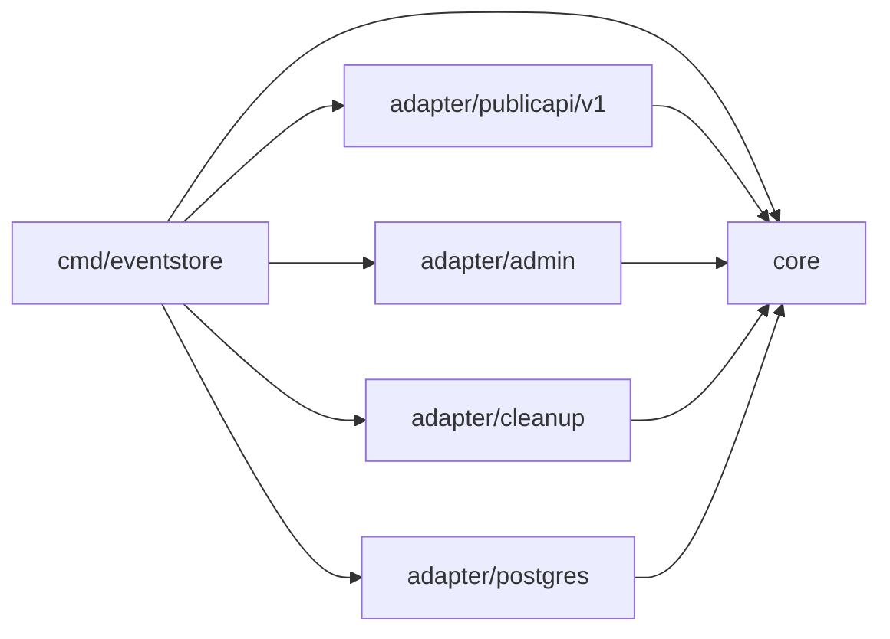
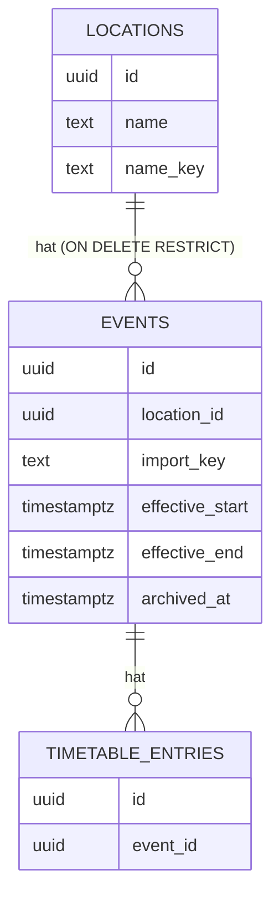
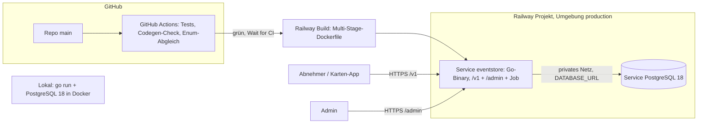

# Architecture Spine — OZ Zirndorf Event Store

## Design Paradigm

**Hexagonal light (Ports & Adapters).** Ein Go-Programm, ein Deployment. In der Mitte liegt der **Kern** mit Entitäten, Fachregeln, Anwendungsfällen und Port-Interfaces. Er hängt nur von der Go-Standardbibliothek ab. Um ihn herum liegen vier **Adapter**: die öffentliche API, die Admin-Oberfläche, PostgreSQL und der Bereinigungsjob.

| Schicht | Verzeichnis | Inhalt |
| --- | --- | --- |
| Kern | `internal/core` | Event, Ort, Ablaufplan, Zeitmodell, Vorbei-Regel, Duplikatprüfung, Import-Klassifizierung, Anwendungsfälle, Ports (`EventRepo`, `LocationRepo`, `TxRunner`, `Clock`) |
| Adapter Public API | `internal/adapter/publicapi/v1` | aus OpenAPI generiertes Gerüst + Handler, CORS |
| Adapter Admin | `internal/adapter/admin` | HTML-Handler, Templates, htmx, Session, Import-Viewer, Kartenpicker |
| Adapter Postgres | `internal/adapter/postgres` | sqlc-Abfragen, goose-Migrationen, Implementierung der Repository- und Tx-Ports |
| Adapter Cleanup | `internal/adapter/cleanup` | täglicher Bereinigungsjob |
| Verdrahtung | `cmd/eventstore` | Konfiguration, Logging, Zusammenbau, HTTP-Server, `time/tzdata` |

## Invariants & Rules



*Abhängigkeiten zeigen nur nach innen. Adapter kennen einander nicht. Nur `cmd/eventstore` kennt alle.*

### AD-1 — Abhängigkeitsrichtung nach innen [ADOPTED]

- **Binds:** all
- **Prevents:** Fachregeln, die von HTTP-, SQL- oder Template-Typen abhängen; Adapter, die sich gegenseitig aufrufen.
- **Rule:** `internal/core` importiert nur die Standardbibliothek. Adapter importieren `core`, nie einen anderen Adapter. Ports (Interfaces) definiert der Kern, Adapter implementieren sie.

### AD-2 — Fachlogik nur im Kern, SQL ohne Regeln [ADOPTED]

- **Binds:** FR-1 bis FR-18, KON-4
- **Prevents:** Dieselbe Regel (Vorbei, „heute“, Duplikat, Namensvergleich, Pflichtfelder) einmal in Go und einmal in SQL, die dann auseinanderlaufen.
- **Rule:** SQL macht nur CRUD und einfache Vergleiche auf gespeicherten Spalten. Keine Regel-Logik in SQL: keine Views, Trigger, Funktionen, `lower()`/`trim()`-Vergleiche oder `CASE` mit Fachbedeutung. SQL ruft nie `now()` auf, die aktuelle Zeit kommt als Parameter aus dem `Clock`-Port des Kerns. Abgeleitete Werte (z. B. `effective*`, `nameKey`) berechnet der Kern und speichert sie mit.

### AD-3 — Ehrliches Zeitmodell [ADOPTED]

- **Binds:** FR-1, FR-2, FR-4, FR-8, FR-9, FR-12, FR-13, KON-4, NFR-6
- **Prevents:** Platzhalter-Uhrzeiten (`00:00` als „unbekannt“); eine Genauigkeit, die in einem Adapter anders abgeleitet wird als im anderen.
- **Rule:** Gespeichert werden `startDate` (Pflicht), `startTime` (optional), `endDate` (optional), `endTime` (optional) und `allDay` (bool), alles als lokale Werte für Europe/Berlin. Eine leere Uhrzeit bedeutet „unbekannt“, nie Mitternacht. Ist `allDay` gesetzt, werden Uhrzeiten abgelehnt. Die Zeitgenauigkeit (`exact` / `dateOnly` / `allDay`) wird im Kern **abgeleitet**, getrennt für Beginn und Ende, und nicht gespeichert.

### AD-4 — Effektiver Zeitraum als einzige Abfragegrundlage [ADOPTED]

- **Binds:** FR-8, FR-9, FR-11, FR-12, FR-13, KON-5
- **Prevents:** „Heute“, Zeitraumfilter und Archiv, die die Vorbei-Regel unterschiedlich auslegen.
- **Rule:** Bei jedem Schreiben berechnet der Kern über AD-16 `effectiveStart` und `effectiveEnd` (`timestamptz`) und speichert sie mit. Fehlt die Uhrzeit beim Beginn, gilt der Tagesbeginn. Fehlt sie beim Ende, gilt der Beginn des Folgetages des End-Tages. Fehlt das Ende ganz, gilt der Beginn des Folgetages des Beginn-Tages. Intervalle sind halboffen `[effectiveStart, effectiveEnd)`. Aktiv heißt `effectiveEnd > now`, archiviert heißt `effectiveEnd <= now`. Alle Lese-Abfragen filtern **nur** über diese Spalten.

### AD-5 — Eine Tabelle, Archiv ist berechnet [ADOPTED]

- **Binds:** FR-8, FR-11, FR-12, FR-13, FR-15
- **Prevents:** Eine Lücke oder Doppelung zwischen aktivem und archiviertem Bestand; API-Antworten, die vom Zeitpunkt des Jobs abhängen.
- **Rule:** Alle Events liegen in **einer** Tabelle. Ob ein Event archiviert ist, entscheidet ausschließlich AD-4. Das API-Feld `archived` wird daraus abgeleitet. Der Bereinigungsjob setzt nur `archivedAt` als Markierung für Statistik. Keine Lese-Abfrage und keine Ausgabe wertet `archivedAt` aus. `SaveEvent` leert `archivedAt`, wenn das Event danach wieder aktiv ist.

### AD-6 — Schreiben nur über Kern-Anwendungsfälle [ADOPTED]

- **Binds:** FR-1 bis FR-7, FR-14 bis FR-18, NFR-4
- **Prevents:** Admin-Formular und Import validieren unterschiedlich; ein Adapter schreibt am Kern vorbei in die Datenbank.
- **Rule:** Events und Orte werden ausschließlich über Anwendungsfälle des Kerns geschrieben: `SaveEvent`, `DeleteEvent`, `SaveLocation`, `DeleteLocation`, `CommitImport`. Admin-Formular und Import nutzen **denselben** Eingabetyp `core.EventInput` und dieselben Anwendungsfälle. Repository-Ports bieten Adaptern keine Schreibmethode an, die den Kern umgeht. Der Löschschutz für Orte (FR-7) liegt im Kern und wird zusätzlich durch einen Fremdschlüssel `ON DELETE RESTRICT` abgesichert. Das Datenmodell hat keine Felder für Personen (NFR-4).

### AD-7 — Lesen über Kern-Abfragen [ADOPTED]

- **Binds:** FR-8 bis FR-12, KON-4, KON-6
- **Prevents:** Die Public API greift direkt auf die Datenbank zu, leitet Genauigkeit oder Archivstatus selbst ab oder sortiert anders.
- **Rule:** Die Public API ruft Abfrage-Anwendungsfälle des Kerns auf: `ListActiveEvents`, `ListArchivedEvents`, `GetEvent`, `ListLocations`, `ListEventTypes`. Sie liefern Kern-Objekte mit abgeleiteter Genauigkeit und `archived`. Der Adapter bildet sie nur auf die generierten Typen ab. Sortierung: aktive Events nach `effectiveStart` aufsteigend, das Archiv nach `effectiveStart` absteigend, bei Gleichstand nach `id`.

### AD-8 — OpenAPI ist der Vertrag (spec-first), eine Spec pro Hauptversion [ADOPTED]

- **Binds:** NFR-2, NFR-3, KON-1 bis KON-8, FR-8 bis FR-12, FR-16
- **Prevents:** Eine Doku, die vom Code abweicht; Handler mit Feldnamen oder Codes, die nicht in der Doku stehen; ein Versionswechsel, der die alte Version bricht.
- **Rule:** `api/v1/openapi.yaml` ist die einzige Quelle für Pfade, Parameter, Feldnamen, Enum-Codes und Fehlerformat von v1. Die Spec nutzt OpenAPI 3.1 ohne Spezialkonstrukte; laufen sie mit `oapi-codegen` nicht, ist 3.0.3 der Rückfall. Das Gerüst wird mit `oapi-codegen` (`std-http-server` + `strict-server`) erzeugt und eingecheckt, generierter Code wird nie von Hand geändert. Eine neue Hauptversion bekommt eine eigene Spec `api/v2/…` und ein eigenes Paket `adapter/publicapi/v2`, die alte bleibt parallel bestehen (KON-2). Ihr Abschaltdatum steht in `info` der alten Spec und in einem `Sunset`-Header. Spec und Import-Schema werden öffentlich ausgeliefert: `/v1/openapi.yaml` und `/v1/import-v1.schema.json`.

### AD-9 — Eine Quelle für Feldnamen und Codes [ADOPTED]

- **Binds:** FR-5, FR-16, KON-7
- **Prevents:** Import-Schema, API und Go-Konstanten im Kern mit unterschiedlichen Feldnamen oder Enum-Codes.
- **Rule:** Enum-Codes und die Eingabeform `EventInput` sind **nur** in `api/v1/openapi.yaml` (`components/schemas`) definiert. `api/v1/import-v1.schema.json` bindet sie per `$ref` ein, statt sie zu kopieren. Die Konstanten im Kern spiegeln die Codes. Ein Test in CI prüft, dass Kern-Konstanten und Spec übereinstimmen. Jede Import-Datei trägt `formatVersion`, der Kern lehnt unbekannte Versionen ab.

### AD-10 — Zustandsloser Import, Abschluss in einer Transaktion [ADOPTED]

- **Binds:** FR-16, FR-17, FR-18
- **Prevents:** Ein halb übernommener Import; Entscheidungen, die auf einem veralteten Stand beruhen; ein Fehler in einem Eintrag, der den ganzen Import zurückrollt; verwaister Entwurfszustand auf dem Server.
- **Rule:** Ablauf:
  1. **Upload:** Der Kern parst, validiert und klassifiziert jeden Eintrag gegen den **gesamten** Bestand, archivierte Events eingeschlossen. Klassen: `new`, `update`, `duplicateSuspect`, `error`, außerdem pro Ort `newLocation`.
  2. **Konflikte innerhalb der Datei:** Ein doppelter `importKey` macht beide Einträge zu `error`. Gleiche Einträge (AD-11) werden untereinander zu `duplicateSuspect`. Derselbe neue Ort wird nur einmal angelegt.
  3. **Viewer:** Der Admin arbeitet alle Einträge durch. Der Zwischenstand liegt nur im Browser-Formular, der Server speichert keinen Entwurf.
  4. **Speichern:** Der vollständige Satz wird samt Entscheidungen gesendet. Jede Entscheidung trägt die beim Upload ermittelte Klasse und gegebenenfalls die Ziel-ID. Der Kern klassifiziert erneut. Weicht die Klasse oder die Ziel-ID ab, wird der Eintrag **nicht** übernommen und als `stale` gemeldet.
  5. **Schreiben:** Einträge mit `error`, `stale` oder einem Duplikatverdacht ohne Entscheidung werden **vor** der Transaktion aussortiert. Alle übrigen schreibt der Kern über den Port `TxRunner` in **einer** Transaktion.
  6. **Ergebnis:** Der Kern liefert eine Zusammenfassung mit der Anzahl neuer, aktualisierter, übersprungener, fehlerhafter und veralteter Einträge (FR-18).

### AD-11 — Identität, Namensschlüssel und Duplikatprüfung [ADOPTED]

- **Binds:** FR-6, FR-15, FR-16, FR-17, FR-18
- **Prevents:** Import und Admin erkennen „dasselbe Event“ oder „denselben Ort“ unterschiedlich; eine Duplikatprüfung, die „trotzdem anlegen“ unmöglich macht oder stille Duplikate zulässt.
- **Rule:**
  - **IDs:** Events, Orte und Ablaufplan-Einträge haben UUIDv7-Kennungen, erzeugt per `DEFAULT uuidv7()` in PostgreSQL 18.
  - **`importKey`:** Ein Event kann einen `importKey` haben. Ist er gesetzt, ist er eindeutig.
  - **Ortsnamen:** Der Kern bildet mit `NormalizeKey` einen Schlüssel (getrimmt, Kleinbuchstaben) und speichert ihn als eindeutige Spalte `name_key`.
  - **Duplikatprüfung:** Die Kernfunktion `FindDuplicateCandidates` meldet einen Verdacht, wenn `NormalizeKey(title)`, `startDate` und `locationId` übereinstimmen. Sie prüft gegen alle Events, archivierte eingeschlossen.
  - **Duplikat-Policy:** `SaveEvent` erhält eine ausdrückliche Policy, `rejectDuplicates` oder `allowDuplicates`. Das Admin-Formular nutzt zuerst `rejectDuplicates` und zeigt bei einem Verdacht eine Warnung. Erst nach Bestätigung speichert es mit `allowDuplicates`. Der Import setzt die Policy pro Eintrag aus der Entscheidung des Admins.

### AD-12 — Getrennte Oberflächen: `/v1` öffentlich, `/admin` geschützt [ADOPTED]

- **Binds:** FR-14, NFR-1, NFR-4, KON-1
- **Prevents:** CORS oder fehlende Anmeldung leaken auf Admin-Funktionen; die öffentliche API bekommt Schreibpfade.
- **Rule:** Die öffentliche API liegt ausschließlich unter `/v1/…`. Sie ist nur lesend (`GET`) und hat offenes CORS. Die Admin-Oberfläche liegt ausschließlich unter `/admin/…`. Sie hat kein CORS, verlangt eine Session (HttpOnly, Secure, SameSite=Strict) und ist mit `http.CrossOriginProtection` aus der Standardbibliothek gegen gefälschte Formular-Absendungen (CSRF) geschützt. Es gibt genau ein Admin-Konto: Benutzername und bcrypt-Hash liegen in Umgebungsvariablen, eine Registrierung gibt es nicht.

### AD-13 — Bereinigungsjob im Programm, idempotent [ADOPTED]

- **Binds:** FR-13, NFR-5
- **Prevents:** Ein externer Cron, der ausfällt oder doppelt läuft und dadurch Ergebnisse verändert.
- **Rule:** Der Job läuft im Programm einmal beim Start und danach täglich. Er setzt `archivedAt` für Events mit `effectiveEnd <= now` und leerem `archivedAt`. Er ist idempotent und darf beliebig oft laufen. Ein Ausfall ändert keine API-Antwort (AD-5).

### AD-14 — Eine Datenform für Lesen und Schreiben [ADOPTED]

- **Binds:** FR-1, FR-2, FR-10, FR-16, KON-4, KON-7
- **Prevents:** Zeitfelder, die in API, Import und Admin unterschiedlich heißen oder aussehen.
- **Rule:** Die Schreibform `EventInput` enthält `title`, `type`, `locationId` oder einen mitgebrachten Ort (nur Import), `startDate`, `startTime`, `endDate`, `endTime`, `allDay`, `source`, `note`, `timetable` und `importKey` (nur Import). Die Leseform `Event` ist `EventInput` (ohne `importKey`) **plus** abgeleitete Felder: `id`, `location` (vollständig), `startPrecision`, `endPrecision`, `effectiveStart`, `effectiveEnd` und `archived`. Formate: `startDate`/`endDate` als `YYYY-MM-DD`, `startTime`/`endTime` als `HH:MM` lokale Zeit Europe/Berlin oder `null`, `effective*` als ISO 8601 mit Offset.

### AD-15 — Ablaufplan als Wertobjekt des Events [ADOPTED]

- **Binds:** FR-4, FR-15, FR-16
- **Prevents:** Admin und Import bauen den Ablaufplan unterschiedlich (Teilupdates gegen Ersetzen, Zeitpunkte gegen Uhrzeiten).
- **Rule:** Der Ablaufplan gehört dem Event und wird nur über `SaveEvent` geschrieben, immer als ganze Liste, die die vorherige ersetzt. Jeder Eintrag hat `description`, `date`, `startTime` (optional), `endTime` (optional), nach dem Zeitmodell aus AD-3. Einträge müssen im Zeitraum des Events liegen. Der Ablaufplan ändert `effective*` nicht.

### AD-16 — Zeitumrechnung an genau einer Stelle [ADOPTED]

- **Binds:** FR-8, FR-9, FR-12, NFR-6, KON-5
- **Prevents:** Unterschiedliche Tagesgrenzen, Fehler bei der Zeitumstellung, abweichende Uhren und unterschiedliche Filtergrenzen in verschiedenen Teilen.
- **Rule:**
  - **Umrechnung:** Lokale Datums- und Uhrzeitwerte rechnet ausschließlich die Kernfunktion `ToInstant` in Zeitpunkte um, Zeitzone Europe/Berlin.
  - **Zeitumstellung:** Uhrzeiten in der Lücke bei der Umstellung im Frühjahr werden abgelehnt. Doppelte Uhrzeiten im Herbst bekommen den früheren Offset.
  - **Uhr:** Die aktuelle Zeit kommt nur aus dem Port `Clock`.
  - **Filter:** Der Kern normalisiert `from`/`to` zu einem halboffenen Intervall `[lo, hi)`. Ist nur ein Datum angegeben, gilt der ganze Tag inklusive. Das einzige Filterprädikat lautet `effectiveStart < hi AND effectiveEnd > lo`.
  - **Zeitzonendaten:** `cmd/eventstore` bettet `time/tzdata` ein.
  - **Neuberechnung:** Beim Start berechnet der Kern `effective*` für alle Events neu. So greifen Änderungen an den Regeln sofort.

### AD-17 — Migrationen ohne Datenverlust [ADOPTED]

- **Binds:** NFR-5, Betrieb
- **Prevents:** Eine automatisch beim Deploy laufende Migration zerstört gepflegte Daten, für die es kein Backup gibt.
- **Rule:** Migrationen sind nur vorwärts und **expand/contract**: Spalten oder Tabellen werden nie im selben Deploy entfernt oder umbenannt, in dem der Code aufhört, sie zu nutzen. Vor jedem Deploy, der eine neue Migration enthält, zieht der Admin einen `pg_dump` über die Railway-CLI. Angewendete Migrationen werden nie geändert.

## Consistency Conventions

| Concern | Convention |
| --- | --- |
| Sprache | Alles Technische ist englisch: Code, Bezeichner, Feldnamen, Pfade, Parameter, Enum-Codes, Fehlermeldungen, Logs. Inhalte (Titel, Notizen, Ortsnamen) und die Admin-Oberfläche sind deutsch. |
| Feldnamen JSON | camelCase (KON-7), Formen nach AD-14 |
| Datenbank | snake_case, Tabellennamen im Plural: `events`, `locations`, `timetable_entries` |
| Enum-Codes | Event-Typen: `festival`, `market`, `culture`, `politics`, `club`, `sports`, `other`. Zeitgenauigkeit: `exact`, `dateOnly`, `allDay`. Ortsgenauigkeit: `building`, `street`, `area`, `district`. Quelle: AD-9 |
| IDs | UUIDv7 als String in JSON |
| Fehler | RFC 9457 Problem Details (`application/problem+json`), englischer `title`/`detail` (KON-3) |
| Listen | Hülle `{ "data": [ … ] }` (KON-8). Sortierung nach AD-7 |
| Fehlerbehandlung im Code | Der Kern liefert typisierte Fehler (`ErrValidation`, `ErrNotFound`, `ErrConflict`, `ErrDuplicateSuspect`). Nur die Adapter übersetzen sie in HTTP-Status oder Problem Details. |
| Logging | `log/slog` als JSON auf stdout. Keine Passwörter oder Session-Daten im Log. |
| Konfiguration | Nur Umgebungsvariablen (`DATABASE_URL`, `PORT`, `ADMIN_USER`, `ADMIN_PASSWORD_HASH`, `SESSION_SECRET`), eingelesen in `cmd/eventstore`. Den bcrypt-Hash wegen des `$` quoten. |
| Migrationen | goose-SQL-Dateien, eingebettet (`embed`), laufen beim Start vor dem HTTP-Server. Regeln nach AD-17. `uuidv7()` nur in `DEFAULT`, nicht in sqlc-Queries (sqlc parst mit PG-17-Grammatik). |
| Statische Dateien | htmx und Leaflet als Dateien im Repo (`adapter/admin/static`), kein CDN |
| Tests | Kernregeln (Zeitmodell, `ToInstant`, Vorbei-Regel, Duplikat, Import-Klassifizierung) mit Unit-Tests ohne Datenbank und mit fester `Clock`. Postgres-Adapter mit Tests gegen echtes PostgreSQL 18 (Docker). CI prüft: Tests, generierter Code aktuell, Enum-Abgleich (AD-9). |

## Stack

| Name | Version |
| --- | --- |
| Go | 1.27.1 |
| PostgreSQL (Railway-Service) | 18 (ausdrücklich gepinnt, Railway `:latest` = 16) |
| pgx | v5.11.0 |
| sqlc | 1.31.1 |
| goose | v3.28.0 |
| oapi-codegen | v2.8.0 |
| golang.org/x/crypto (bcrypt) | v0.57.0 |
| htmx | 2.0.11 |
| Leaflet + OpenStreetMap-Kacheln | 1.9.4 |
| HTTP, Templates, Logging, CSRF | Go-Standardbibliothek (`net/http`, `html/template`, `log/slog`, `http.CrossOriginProtection`) |

## Structural Seed





- **Railway:** ein Projekt mit der Umgebung `production` und zwei Services: der App und PostgreSQL 18. Die Datenbank ist nur über das private Netz erreichbar.
- **Deploy:** „Wait for CI“ ist aktiviert, Railway deployt also erst, wenn die GitHub Actions grün sind. In `railway.json` sind `healthcheckPath: /healthz` und das Dockerfile eingetragen.
- **Health Check:** `GET /healthz` prüft, ob die Datenbank erreichbar ist. Migrationen und die Neuberechnung beim Start müssen innerhalb des Railway-Zeitlimits fertig sein, bei einigen hundert Events ist das unkritisch.
- **Lokal:** PostgreSQL 18 per Docker Compose, das Volume liegt unter `/var/lib/postgresql`. Migrationen und Umgebungsvariablen sind dieselben wie in Produktion.

```text
api/v1/
  openapi.yaml            # Vertrag der Public API v1 (AD-8, AD-9, AD-14)
  import-v1.schema.json   # Import-Format, $ref auf openapi.yaml (AD-9)
cmd/eventstore/           # main, Konfiguration, Verdrahtung, tzdata
internal/
  core/                   # Entitäten, Regeln, Anwendungsfälle, Ports
  adapter/
    publicapi/v1/         # generiertes Gerüst + Handler
    admin/                # HTML-Handler, templates/, static/ (htmx, Leaflet)
    postgres/             # queries/, migrations/, sqlc-Code
    cleanup/              # Bereinigungsjob
Dockerfile
railway.json
compose.yaml              # lokales PostgreSQL 18
.github/workflows/ci.yaml
```

## Capability → Architecture Map

| Capability / Area | Lives in | Governed by |
| --- | --- | --- |
| FR-1–FR-5 Event-Daten, Zeitgenauigkeit, Quelle, Ablaufplan, Typen | `core` | AD-2, AD-3, AD-6, AD-14, AD-15, AD-9 |
| FR-6, FR-7 Orte, Löschschutz | `core` + `adapter/postgres` | AD-6, AD-11 |
| FR-8–FR-11 Lese-API | `adapter/publicapi/v1` → `core` | AD-4, AD-7, AD-8, AD-12, AD-14, AD-16 |
| FR-12, FR-13 Archiv, Bereinigung | `core` + `adapter/cleanup` | AD-4, AD-5, AD-13 |
| FR-14, FR-15 Admin-Anmeldung, Pflege, Kartenpicker | `adapter/admin` → `core` | AD-5, AD-6, AD-11, AD-12 |
| FR-16–FR-18 JSON-Import | `adapter/admin` → `core` | AD-9, AD-10, AD-11, AD-14 |
| NFR-1–NFR-3, KON-1–KON-8 API-Vertrag | `api/v1/` | AD-8, AD-9, AD-12, AD-14, Conventions |
| NFR-4 keine personenbezogenen Daten | `core` (Datenmodell) | AD-6 |
| NFR-5, NFR-6 Betrieb, Zeitzone | `cmd/eventstore`, Railway | AD-13, AD-16, AD-17, Structural Seed |

## Deferred

- **Automatisches Backup:** Der Railway-Hobby-Plan bietet keine Volume-Backups. Bis dahin gelten AD-17 (manueller Dump vor Migrationen) und die Import-Dateien im Git als Teilsicherung. Wiedervorlage vor dem öffentlichen Start oder beim Wechsel auf den Pro-Plan, dann per Cron-Service mit `pg_dump` in einen Bucket.
- **Lizenz für Code und Daten:** Blocker für den öffentlichen Start (PRD, Offene Frage 1), aber nicht für den Bau. Der Lizenzhinweis kann später ohne Bruch in die Listenhülle (KON-8).
- **Gleichzeitige Bearbeitung:** Versionsspalten oder Sperren gegen verlorene Änderungen sind bei einem Admin nicht nötig. Wiedervorlage, sobald es mehrere Pfleger gibt.
- **Domain und TLS:** Für den Anfang reicht die Railway-Standarddomain. Eine eigene Domain kommt mit dem öffentlichen Start.
- **Staging-Umgebung:** Für einen Entwickler nicht nötig. Wiedervorlage bei weiteren Pflegern oder Abnehmern.
- **Rate Limiting / Caching:** Bei Hobby-Last nicht nötig (NFR-5). Nachrüstbar als Middleware in `adapter/publicapi`, ohne den Kern zu berühren.
- **Monitoring über Logs hinaus:** Railway-Logs reichen. Metriken erst bei Bedarf.
- **Interne Kern-Struktur:** die Paketaufteilung in `core` und weitere Anwendungsfälle über die genannten hinaus. Das legen die Stories fest, im Rahmen von AD-1 und AD-2.
- **Admin-Gestaltung** (Layout, CSS): Story-Ebene, optional `bmad-ux`.
- **PostGIS / Umkreissuche:** außerhalb von v1. Bei Bedarf als Erweiterung des PostgreSQL-Service nachrüstbar.
