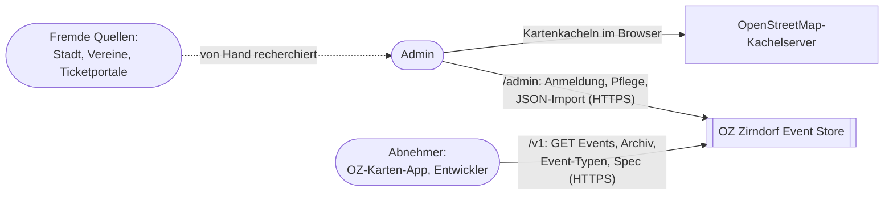
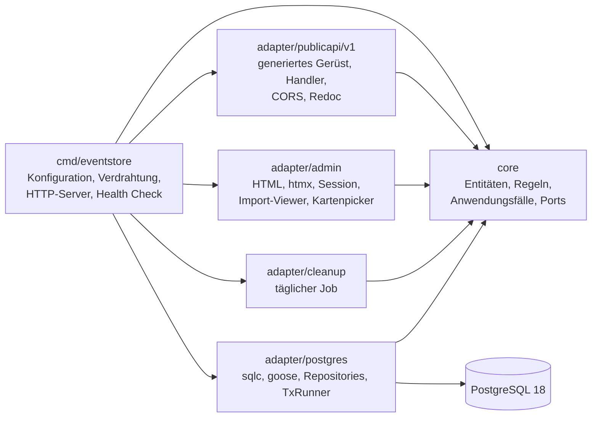
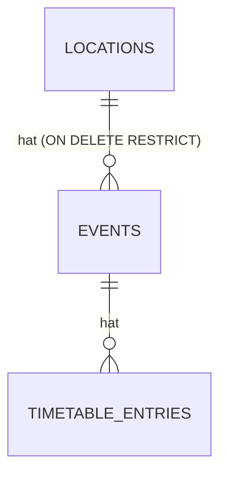
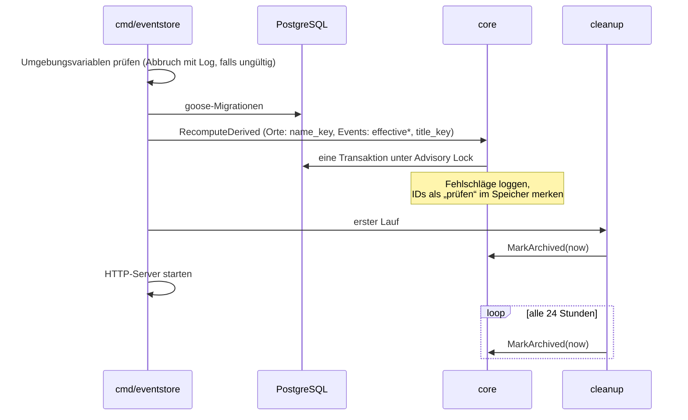
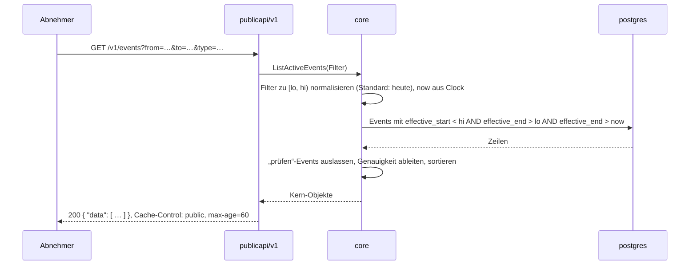
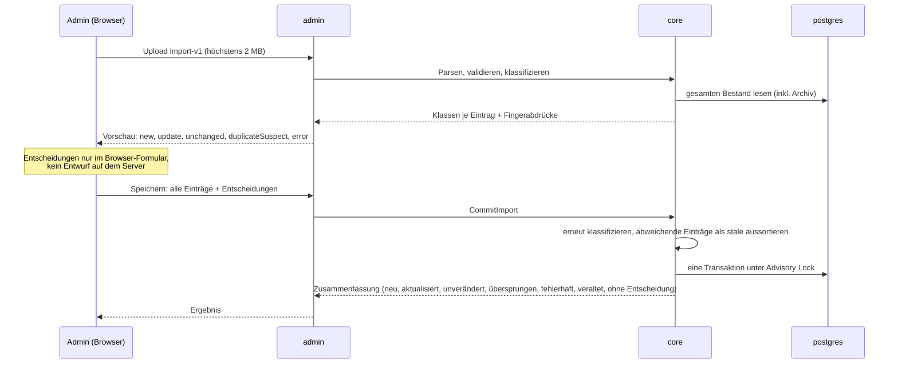
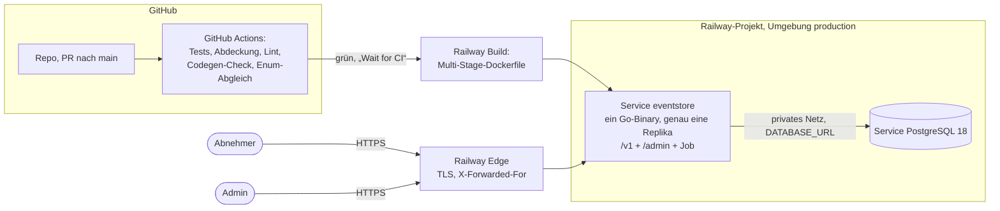

# Architekturdokumentation nach arc42 — OZ Zirndorf Event Store

Diese Doku folgt der Gliederung von [arc42](https://arc42.org) und soll beim **Verstehen** helfen: Sie richtet sich an alle, die das System kennenlernen oder als Vorlage für ein eigenes OZ-Backend nutzen wollen.

Verbindlich bleibt der [Architecture Spine][spine]: Er enthält die Entscheidungen AD-1 bis AD-18 samt Regeln, Stack-Versionen und Konventionen. Diese Doku wiederholt ihn nicht, sondern verweist darauf und ergänzt die Sichten, die dort fehlen: Kontext, Laufzeit und Verteilung. Bei einem Widerspruch gilt der Spine.

[spine]: ../../_bmad-output/planning-artifacts/architecture/architecture-oz-zirndorf-event-store-2026-10-01/ARCHITECTURE-SPINE.md
[prd]: ../../_bmad-output/planning-artifacts/prds/prd-oz-zirndorf-event-store-2026-10-01/prd.md
[deferred]: ../../_bmad-output/implementation-artifacts/deferred-work.md
[openapi]: ../../api/v1/openapi.yaml

## 1. Einführung und Ziele

Der Event Store sammelt Veranstaltungen in Zirndorf und stellt sie über eine öffentliche, nur lesende REST-API bereit. Ein einzelner Admin pflegt die Events von Hand oder per JSON-Import. Erster Abnehmer ist die Karten-App von OpenZirndorf. Die Anforderungen (FR-1 bis FR-18, NFR-1 bis NFR-6, KON-1 bis KON-8) stehen im [PRD][prd].

### Qualitätsziele

| Priorität | Ziel | Bedeutung |
| --- | --- | --- |
| 1 | **Ehrliche Angaben** | Unbekanntes bleibt unbekannt: keine erfundene Uhrzeit, Zeit- und Ortsgenauigkeit und Quelle bei jedem Event (FR-2, FR-3, SM-3). |
| 2 | **Eindeutige Regeln** | „Heute“, Archiv, Duplikat und Zeitumrechnung gelten überall gleich, weil jede Regel genau einmal im Kern steht (AD-2, AD-4, AD-16). |
| 3 | **Vorlage-Tauglichkeit** | API-Konventionen, OpenAPI-Vertrag, Code und Tests sollen andere OZ-Backends übernehmen können (NFR-3, SM-4). |
| 4 | **Robust auf Hobby-Niveau** | Keine Zielwerte für Antwortzeit, aber ein einzelner Client oder eine langsame Datenbank darf den Dienst nicht zum Absturz bringen (NFR-5, AD-18). |

### Stakeholder

| Rolle | Erwartung |
| --- | --- |
| Admin (Andreas) | Termine schnell und ohne stille Duplikate erfassen, Fehler einzeln korrigieren |
| Abnehmer (OZ-Karten-App, weitere Frontends) | Einfache, stabile, versionierte Lese-API mit Zeitraum- und Typfilter |
| OZ-Mitglieder, Entwickler | Nachvollziehbares Muster für eigene Backends |
| Menschen in Zirndorf (indirekt) | Sehen über die Karte, was los ist |

## 2. Randbedingungen

| Art | Randbedingung |
| --- | --- |
| Technik | Go 1.27.1, PostgreSQL 18 (ausdrücklich gepinnt, Railway `:latest` ist 16). Weitere Versionen: Stack-Tabelle im [Spine][spine]. |
| Betrieb | Railway (Hobby-Plan), genau eine Replika der App, keine Volume-Backups durch das Hosting. |
| Organisation | Ein Entwickler und ein Admin. Änderungen nur per Pull Request, Test-first, 100 % Abdeckung für Kern, Public API und Admin. |
| Vertrag | Spec-first: `api/v1/openapi.yaml` ist die einzige Quelle für Pfade, Feldnamen und Codes (AD-8, AD-9). |
| Daten | Keine personenbezogenen Daten in Events und Orten (NFR-4). |
| Sprache | Alles Technische englisch, Inhalte und Admin-Oberfläche deutsch. |
| Auslieferung | Keine CDNs: htmx, Leaflet und Redoc liegen eingebettet im Programm. |
| Offen | Lizenz für Code und Daten blockiert den öffentlichen Start, nicht die Entwicklung (PRD, Offene Frage 1). |

## 3. Kontextabgrenzung

| Partner | Schnittstelle | Richtung |
| --- | --- | --- |
| Abnehmer | `GET /v1/events`, `/v1/archive/events`, `/v1/event-types`, dazu `/v1/openapi.yaml`, `/v1/import-v1.schema.json`, `/v1/docs`. JSON, Listenhülle `{ "data": [ … ] }`, Fehler als RFC 9457 Problem Details, CORS offen. | nur lesend |
| Admin | HTML-Oberfläche unter `/admin/…` mit Session-Cookie; JSON-Import im Format `import-v1`. | lesend und schreibend |
| OpenStreetMap | Der Browser des Admins lädt Kacheln für den Kartenpicker direkt von `tile.openstreetmap.org`. Der Server spricht nicht mit OSM. | außerhalb des Servers |
| Fremde Quellen | Kein technischer Anschluss. Es gibt kein Crawling; der Admin recherchiert und nennt die Quelle pro Event. | – |

Bewusst **nicht** im Kontext: Einreichungen durch Dritte, Crawler, Export, Benachrichtigungen (PRD §8, §9.2).

## 4. Lösungsstrategie

| Ziel | Ansatz | Entscheidungen |
| --- | --- | --- |
| Eindeutige Regeln | **Hexagonal light:** Fachregeln und Anwendungsfälle im Kern ohne Abhängigkeiten, HTTP, Datenbank und Job als Adapter. SQL enthält keine Fachlogik und ruft nie `now()` auf. | AD-1, AD-2, AD-6, AD-7 |
| Ehrliche Angaben | **Ehrliches Zeitmodell:** Datum und optionale Uhrzeit getrennt, Genauigkeit wird abgeleitet. Für Abfragen berechnet der Kern einen effektiven Zeitraum und speichert ihn mit. | AD-3, AD-4, AD-16 |
| Eindeutige Regeln | **Archiv ohne Umzug:** Eine Tabelle; archiviert ist, was `effectiveEnd <= now` erfüllt. Der tägliche Job markiert nur. | AD-5, AD-13 |
| Vorlage-Tauglichkeit | **Spec-first:** OpenAPI-Vertrag, Server-Gerüst mit oapi-codegen, Datenbankcode mit sqlc. Beides generiert und eingecheckt, die CI prüft Aktualität. | AD-8, AD-9, AD-14 |
| Ehrliche Angaben, keine Duplikate | **Zustandsloser Import:** Vorschau mit Klassifizierung, Entscheidungen im Browser, beim Speichern erneute Prüfung, dann eine Transaktion. | AD-10, AD-11 |
| Robust | **Feste Grenzen** für Request-Dauer, Datenbankverbindungen und bcrypt; Schreib-Transaktionen laufen nacheinander. | AD-6, AD-18 |
| Einfacher Betrieb | **Boring technology:** ein Go-Binary, ein PostgreSQL, Konfiguration nur per Umgebungsvariablen, Migrationen beim Start. | AD-17, Konventionen |

## 5. Bausteinsicht

### Ebene 1: Kern und Adapter

Abhängigkeiten zeigen nur nach innen; Adapter kennen einander nicht, nur `cmd/eventstore` kennt alle (AD-1).

| Baustein | Verantwortung | Schnittstellen |
| --- | --- | --- |
| `internal/core` | Event, Ort, Ablaufplan, Zeitmodell (`ToInstant`), Vorbei-Regel, Duplikatprüfung, Import-Klassifizierung. Schreib-Anwendungsfälle (`SaveEvent`, `CommitImport`, `MarkArchived` …) und Abfragen (`ListActiveEvents`, `ListArchivedEvents` …). Liefert typisierte Fehler. | definiert die Ports `EventRepo`, `LocationRepo`, `TxRunner`, `Clock` |
| `internal/adapter/publicapi/v1` | Bildet Kern-Abfragen auf die generierten Typen ab, übersetzt Kernfehler in Problem Details, liefert Spec, Schema und Doku statisch aus. | `/v1/…` |
| `internal/adapter/admin` | Formulare für Events und Orte, Import-Upload und -Viewer, Anmeldung mit Sperre nach Fehlversuchen, CSRF-Schutz. | `/admin/…` |
| `internal/adapter/postgres` | Implementiert die Repository- und Transaktions-Ports; Migrationen sind eingebettet. Nur CRUD und einfache Vergleiche auf gespeicherten Spalten. | Ports des Kerns |
| `internal/adapter/cleanup` | Ruft beim Start und danach alle 24 Stunden `MarkArchived` auf. | Kern-Anwendungsfall |
| `cmd/eventstore` | Liest die Umgebungsvariablen, baut alles zusammen, bestimmt die Startreihenfolge, bettet `time/tzdata` ein, `/healthz`. | Prozess |
| `api/v1/` | `openapi.yaml` (Vertrag) und `import-v1.schema.json` (Import-Format per `$ref` auf die Spec). | Quelle für generierten Code und Kern-Konstanten |

### Datenmodell

Alle Kennungen sind UUIDv7 und nur intern; nach außen ist ein Ort an seinem eindeutigen Namen erkennbar, ein Event hat keine Kennung (AD-11, AD-14). Abgeleitete Spalten (`effective_start`, `effective_end`, `title_key`, `name_key`) berechnet der Kern und speichert sie mit.

## 6. Laufzeitsicht

### 6.1 Programmstart

Die Neuberechnung beim Start sorgt dafür, dass geänderte Regeln sofort für den ganzen Bestand gelten. Ein Event, das die neuen Regeln ablehnen, behält seine Werte, fehlt in beiden öffentlichen Listen und ist im Admin mit „prüfen“ markiert, bis es erfolgreich gespeichert oder gelöscht ist (AD-16).

### 6.2 Öffentliche Abfrage `GET /v1/events`

Ungültige Parameter beantwortet der Adapter mit 400 als Problem Details; überschreitet ein Request die Deadline von 20 Sekunden, antwortet er mit 503 (AD-18). Das Archiv `GET /v1/archive/events` läuft gleich, nur mit `effective_end <= now` und absteigender Sortierung.

### 6.3 JSON-Import

Die erneute Prüfung beim Speichern schützt vor Entscheidungen auf veraltetem Stand: Hat sich ein Bestands-Event seit dem Upload geändert, wird der Eintrag nicht übernommen (AD-10).

## 7. Verteilungssicht

| Knoten | Details |
| --- | --- |
| App-Service | Ein Container aus dem Dockerfile, Health Check `GET /healthz` (prüft die Datenbank). Genau eine Replika, weil Anmeldezähler und „prüfen“-Menge im Speicher liegen. |
| PostgreSQL-Service | Version 18, nur über das private Netz erreichbar. Vor jedem Deploy mit neuer Migration zieht der Admin einen `pg_dump` (AD-17). |
| Lokal | `go run ./cmd/eventstore` und PostgreSQL 18 per `docker compose`; gleiche Migrationen und Umgebungsvariablen wie in Produktion. |

Einrichtung, Deploy-Ablauf und Datensicherung beschreibt die [README](../../README.md#deployment-auf-railway).

## 8. Querschnittliche Konzepte

| Konzept | Kurzfassung | Verbindlich in |
| --- | --- | --- |
| Zeitmodell | Lokale Werte für Europe/Berlin; leere Uhrzeit heißt „unbekannt“. Umrechnung nur in `ToInstant`, Uhr nur über den Port `Clock`, Filter nur über `effective_start`/`effective_end` als halboffenes Intervall. | AD-3, AD-4, AD-16 |
| Eine Datenform | Admin und Import nutzen denselben Eingabetyp `core.EventInput` und dieselben Anwendungsfälle. Lese- und Schreibform haben dieselben Feldnamen. | AD-6, AD-14 |
| Eine Quelle für Namen und Codes | Feldnamen, Enum-Codes und Längengrenzen stehen nur in der [OpenAPI-Spec][openapi]; ein Test prüft die Kern-Konstanten dagegen. | AD-9 |
| Texte und Identität | Unicode NFC an einer Stelle im Kern; Namensschlüssel für Orte und Titel; Duplikatverdacht bei gleichem Titel, Beginn-Datum und Ort. | AD-11 |
| Fehlerbehandlung | Der Kern liefert typisierte Fehler (`ErrValidation`, `ErrNotFound`, `ErrConflict`, `ErrDuplicateSuspect`); nur Adapter übersetzen sie in HTTP-Status bzw. Problem Details. | Konventionen |
| Transaktionen und Nebenläufigkeit | Jeder Schreib-Anwendungsfall läuft über `TxRunner`; eine Advisory Lock serialisiert Schreib-Transaktionen. | AD-6 |
| Sicherheit | `/v1` nur `GET` mit offenem CORS; `/admin` mit signiertem Session-Cookie, CSRF-Schutz aus der Standardbibliothek, bcrypt (Kosten ≥ 12), Sperre nach 5 Fehlversuchen. | AD-12, AD-18 |
| Logging | `log/slog` als JSON auf stdout; keine Passwörter, Session-Daten oder Client-IPs. | Konventionen |
| Migrationen | goose, eingebettet, beim Start; nur vorwärts und expand/contract. | AD-17 |
| Tests | Kernregeln ohne Datenbank mit fester `Clock`; Postgres-Adapter gegen echtes PostgreSQL 18; CI-Gates für Abdeckung, Lint und generierten Code. | Konventionen, AGENTS.md |

## 9. Architekturentscheidungen

Alle Entscheidungen stehen mit Regel und Begründung („Prevents“) im [Architecture Spine][spine]:

| Nr. | Entscheidung |
| --- | --- |
| AD-1 | Abhängigkeitsrichtung nach innen |
| AD-2 | Fachlogik nur im Kern, SQL ohne Regeln |
| AD-3 | Ehrliches Zeitmodell |
| AD-4 | Effektiver Zeitraum als einzige Abfragegrundlage |
| AD-5 | Eine Tabelle, Archiv ist berechnet |
| AD-6 | Schreiben nur über Kern-Anwendungsfälle |
| AD-7 | Lesen über Kern-Abfragen |
| AD-8 | OpenAPI ist der Vertrag (spec-first), eine Spec pro Hauptversion |
| AD-9 | Eine Quelle für Feldnamen und Codes |
| AD-10 | Zustandsloser Import, Abschluss in einer Transaktion |
| AD-11 | Identität, Namensschlüssel und Duplikatprüfung |
| AD-12 | Getrennte Oberflächen: `/v1` öffentlich, `/admin` geschützt |
| AD-13 | Bereinigungsjob im Programm, idempotent |
| AD-14 | Eine Datenform für Lesen und Schreiben |
| AD-15 | Ablaufplan als Wertobjekt des Events |
| AD-16 | Zeitumrechnung an genau einer Stelle |
| AD-17 | Migrationen ohne Datenverlust |
| AD-18 | Lastgrenzen |

Änderungen an Entscheidungen laufen über Sprint Change Proposals (`bmad-correct-course`) und landen im Spine, nicht in dieser Doku.

## 10. Qualitätsanforderungen

### Qualitätsszenarien

| Nr. | Qualität | Szenario | Erwartete Reaktion |
| --- | --- | --- | --- |
| QS-1 | Ehrlichkeit | Ein Event hat nur ein Datum, keine Uhrzeit. | Die API liefert `startTime: null` und `startPrecision: dateOnly`, nie `00:00`. |
| QS-2 | Korrektheit | Ein Event endet um 20:00; um 20:00 fragt ein Abnehmer ab. | Das Event steht im Archiv, nicht mehr in `/v1/events`, unabhängig davon, ob der Job schon lief. |
| QS-3 | Korrektheit | Ein Event liegt in der Nacht der Zeitumstellung. | Uhrzeiten in der Lücke im Frühjahr werden abgelehnt, doppelte im Herbst bekommen den früheren Offset. |
| QS-4 | Datenqualität | Dieselbe Import-Datei wird ein zweites Mal importiert. | 0 zusätzliche Events; alle Einträge sind `unchanged` (SM-2). |
| QS-5 | Datenqualität | Zwischen Upload und Speichern ändert der Admin ein betroffenes Event im Formular. | Der Import-Eintrag wird als `stale` gemeldet und nicht übernommen. |
| QS-6 | Robustheit | Die Datenbank antwortet nicht mehr. | Requests enden nach spätestens 20 Sekunden mit 503; `/healthz` meldet 503; der Prozess bleibt stabil. |
| QS-7 | Sicherheit | Ein Angreifer probiert Passwörter von einer Adresse. | Nach 5 Fehlversuchen ist die IPv4-Adresse bzw. das IPv6-/64-Netz 15 Minuten gesperrt; höchstens zwei bcrypt-Vergleiche laufen gleichzeitig. |
| QS-8 | Wartbarkeit | Eine Regel im Zeitmodell ändert sich. | Die Änderung erfolgt an einer Stelle im Kern; der nächste Start rechnet alle gespeicherten Werte neu. |
| QS-9 | Vorlage-Tauglichkeit | Eine Entwicklerin baut ein neues OZ-Backend. | Sie kann Versionierung, Fehler-, Zeit- und Filterkonventionen aus `/v1/docs` ohne Rückfrage übernehmen (SM-4). |

## 11. Risiken und technische Schulden

| Risiko / Schuld | Auswirkung | Umgang |
| --- | --- | --- |
| Kein automatisches Backup (Hobby-Plan) | Datenverlust bei Ausfall des Volumes | Manueller `pg_dump` vor Migrationen (AD-17), Import-Dateien im Git als Teilsicherung. Restore ist noch nicht erprobt. |
| Zustand im Speicher (Anmeldezähler, „prüfen“-Menge) | Keine horizontale Skalierung | Genau eine Replika; Wiedervorlage bei Bedarf. |
| Kein Rate Limiting pro Client | Eine Request-Flut kann den Dienst verlangsamen | Lastgrenzen aus AD-18 verhindern den Absturz; als Middleware nachrüstbar. |
| Archiv ohne Grenze | `/v1/archive/events` ohne `from` liefert alles | Bei einigen hundert Events unkritisch; Wiedervorlage bei einigen tausend. |
| Admin-JavaScript ohne Browser-Tests | Fehler in Kartenpicker oder htmx-Austausch bleiben bei grüner CI unentdeckt | Manuelle Browserprüfung. |
| Offene Contract-Schritte von Migrationen | Überflüssige Spalte `locations.address` und Default von `title_key` | Eigener PR nach AD-17. |
| Client-IP hängt am Proxy-Aufbau | Ein zusätzlicher Proxy (z. B. Cloudflare) würde die Anmeldesperre aushebeln | Ermittlung der Client-IP dann anpassen (AD-12). |

Die vollständige, gepflegte Liste steht in [`deferred-work.md`][deferred] und im Abschnitt „Deferred“ des [Spines][spine].

## 12. Glossar

Die fachlichen Begriffe (Event, Ort, Zeitgenauigkeit, Ortsgenauigkeit, Ablaufplan, Archiv, Import-Schlüssel, Duplikatverdacht …) definiert das [PRD in §3][prd]. Ergänzend die technischen Begriffe:

| Begriff | Bedeutung |
| --- | --- |
| Kern | `internal/core`: Fachregeln, Anwendungsfälle und Ports, nur von der Standardbibliothek abhängig. |
| Adapter | Baustein, der den Kern mit der Außenwelt verbindet (HTTP, Datenbank, Job). |
| Port | Interface, das der Kern definiert und ein Adapter implementiert (`EventRepo`, `LocationRepo`, `TxRunner`, `Clock`). |
| Effektiver Zeitraum | `[effectiveStart, effectiveEnd)`: aus Datum und Uhrzeit berechnete Zeitpunkte, einzige Grundlage für Filter, „heute“ und Archiv. |
| Namensschlüssel | `name_key` bzw. `title_key`: getrimmte, kleingeschriebene Form eines Namens für Eindeutigkeit und Duplikatprüfung. |
| Kanonische Form | Ergebnis von `Canonicalize`: einheitliche Darstellung eines Events, Grundlage für Speichern und den Import-Vergleich. |
| Fingerabdruck | Aus der kanonischen Form eines gespeicherten Events abgeleiteter Wert, mit dem der Import veraltete Entscheidungen erkennt. |
| „prüfen“ | Markierung für Events und Orte, deren Neuberechnung beim Start gescheitert ist; liegt nur im Speicher. |
| `stale` | Import-Eintrag, dessen Klasse oder Ziel sich seit dem Upload geändert hat; wird nicht übernommen. |
| Problem Details | Fehlerformat nach RFC 9457 (`application/problem+json`). |
| Spine | Der [Architecture Spine][spine]: verbindliche Architekturentscheidungen dieses Projekts. |
